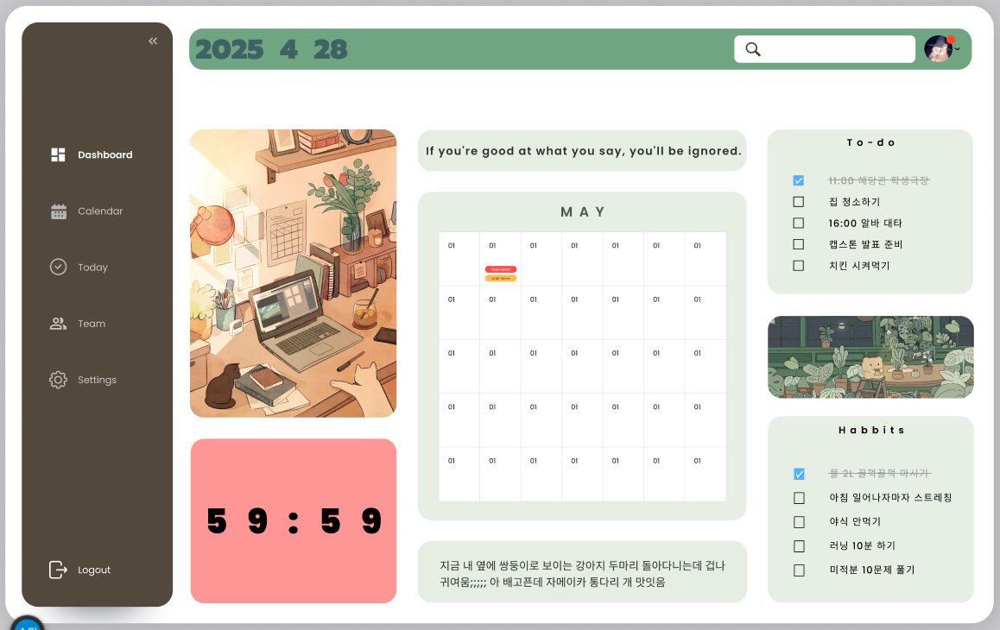
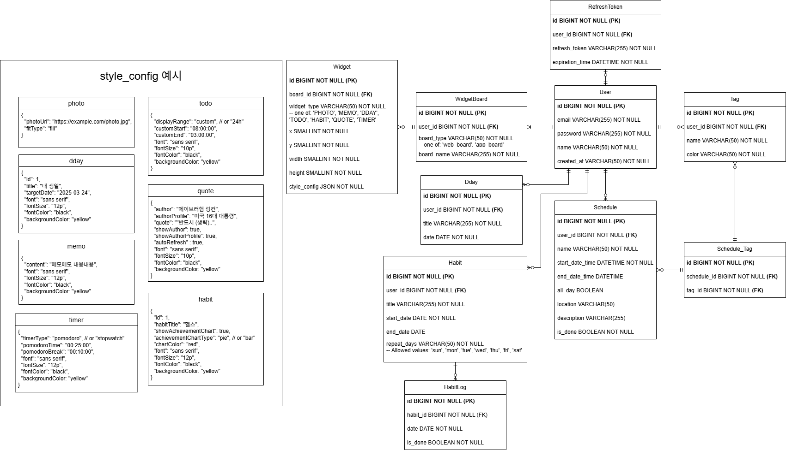

# 🧩 DayFrame: 멀티플랫폼 위젯 애플리케이션
> **DayFrame은 다양한 일상 도구들을 위젯으로 구성하고, 플랫폼 제약 없이 나만의 보드를 자유롭게 디자인할 수 있도록 돕는 멀티플랫폼 애플리케이션입니다**
>

  

---

### 백엔드 아키텍처

  

---

## 🎮 프로젝트 개요
사용자에게 다음과 같은 기능을 제공합니다

-  **1**: 오늘할일, 습관추적, 디데이, 스탑워치, 뽀모도로 타이머, 메모 등 다양한 위젯을 자유롭게 커스터마이징해 배치
-  **2**: 여러 개의 위젯보드 생성 및 사용
-  **3**: PC 웹, 안드로이드, 아이폰 등 멀티플랫폼 지원
-  **4**: 모바일 사용자에게 커스터마이징한 개인 위젯을 배경화면 위젯으로 배치하는 기능 제공

---

## 🛠 기술 스택

### 🎨 Frontend

### ⚙️ Backend

### 🗄 Database & Infra

---

## 👥 기여자

- #### 김승호 – ERD설계, Backend API 개발, AWS EC2 관리
- #### 박준서 - ERD설계, Backend API 개발, AWS RDS 관리
- #### 전승현 - ERD설계, Backend API 개발
- #### 현수민 - 기획, 디자인, Frontend 설계 & 개발
